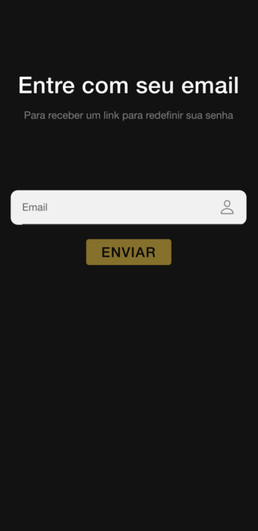

# PokeApp

Este é um projeto desenvolvido em Ionic 7 e Angular 17 que consome a API do Pokémon ([https://pokeapi.co/](https://pokeapi.co/)). O objetivo deste projeto é a visualizacão da lista de pokémons, os detalhes de cada e favoritá-los.

## Ambiente de Desenvolvimento

Para execucão do projeto local:

1. Ter o Node.js e o Angular CLI instalados em seu ambiente
2. Clone este repositório em sua máquina local.
3. No diretório raiz do projeto, execute o seguinte comando para instalar as dependências:

```bash
npm install
```

4. Após a instalação das dependências, você pode iniciar o servidor de desenvolvimento com o seguinte comando:

```bash
ng serve
```

5. O App estará disponível em `http://localhost:4200/` por padrão. URL acessável em qualquer navegador, mais o recomendado é o Google Chrome.

## Funcionalidades

1. **Tela Inicial**: Primeira tela ao iniciar do pokeApp


2. **Tela Login**: Tela de login do pokeApp


3. **Tela Signup**: Tela de cadastro de usuário do pokeApp


4. **Tela Reset Password**: Tela de reset de senha do usuário do pokeApp



5. **Lista de Pokémons**: Exibe uma lista de pokémons com ID, nome, imagem, types e se esta favoritado ou não.


6. **Detalhes do Pokémon**: Permite visualizar os detalhes de cada pokémon, como types, no card About (altura, peso, e habilidades) no card Bases Stats(HP, Attack, Defense, Sp. Attack, Sp. Defense) no card Cries(crie latest e legacy).


7. **Favoritos**: Permite aos usuários favoritar seus pokémons favoritos e visualizar uma lista dos pokémons favoritos.


8. **Confirme Favoritos**: Alert para confirmacão de antes de favoritar pokemon


## Estrutura do Projeto

O projeto tem a seguinte estrutura:

- **src/app/auth**: Contém os componentes Angular de Auth, como `landing`, `login`, `signup` e `reset-password`.
- **src/app/pages**: Contém os componentes Angular de Pages, como `home`, `details` e `favorites`.
- **src/app/core/models**: Contém as definições de modelos TypeScript utilizados para representar os dados do Pokémon.
- **src/app/core/services**: Contém os serviços para consumir a API do Pokémon, gerenciar os favoritos e também contém o service Firebase utilizado na authentication login.

## Dependências Externas

Este projeto utiliza as seguintes dependências externas:

- **Angular 17**: Framework JavaScript para construção de aplicações web.
- **Ionic 7**: Framework de UI para construção de aplicativos móveis híbridos.
- **Firebase**: Servico de authentication login.
- **RxJS**: Biblioteca para programação reativa em JavaScript.
- **HttpClientModule**: Módulo Angular para realizar requisições HTTP.
- **Jasmine**: Framework de testes para JavaScript.
- **Karma**: Test runner para executar testes JavaScript em diversos navegadores.
